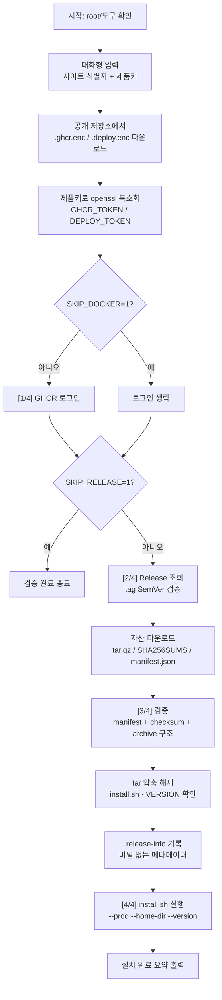
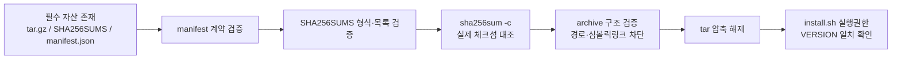

# WizLink Bootstrap (`boot.sh`) 설명서

운영 서버(Rocky Linux / RHEL 계열)에서 WizLink를 설치하기 위한 **진입 스크립트**입니다.
공개 저장소에 있는 **암호화된 인증정보**를 내려받아 **제품키로 복호화**한 뒤, 이를 이용해
GHCR(GitHub Container Registry) 로그인과 `wizlink-deploy` **Release 번들 다운로드·검증·설치**까지
한 번에 수행합니다.

---

## 1. 개요

| 항목 | 내용 |
|------|------|
| 대상 OS | Rocky Linux / RHEL 계열 |
| 실행 권한 | **root** 필요 (`sudo`) |
| 입력 방식 | 대화형 입력만 허용 (사이트 식별자 → 제품키) |
| 최종 동작 | 검증된 번들의 `install.sh` 실행 |

### 필요 도구
- `openssl` — 인증정보 복호화
- `curl` 또는 `wget` — HTTP 다운로드
- `python3` — 대화형 입력, Release JSON/manifest/archive 검증
- `sha256sum`, `tar` — 체크섬 및 압축 해제
- `docker` + `docker compose` plugin — GHCR 로그인 및 서비스 구동

### 실행 방법
```bash
sudo ./boot.sh
# 실행 후: 사이트 식별자 → 제품키 순서로 입력
```

---

## 2. 주요 환경변수

식별자·제품키는 **대화형 입력만** 받으며, 아래 변수는 배포 동작을 조정하는 선택 값입니다.

| 변수 | 기본값 | 설명 |
|------|--------|------|
| `BOOTSTRAP_OWNER` / `BOOTSTRAP_REPO` / `BOOTSTRAP_REF` | `anjin0` / `wizlink-bootstrap` / `main` | `.enc` 인증정보를 받을 공개 저장소 위치 |
| `DEPLOY_OWNER` / `DEPLOY_REPO` | `anjin0` / `wizlink-deploy` | Release를 받을 배포 저장소 |
| `RELEASE_TAG` | `latest` | `latest` 또는 `v1.2.3` 형식 |
| `GHCR_USER` | `anjin0` | GHCR 로그인 사용자 |
| `INSTALL_DIR` | `./wizlink-release` | Release 자산 설치 위치 |
| `WIZLINK_HOME` | `/opt/wizlink` | 서비스 홈 디렉터리 |
| `SKIP_DOCKER` | `0` | `1`이면 GHCR 로그인 생략(검증 전용) |
| `SKIP_RELEASE` | `0` | `1`이면 Release 다운로드·설치 생략(검증 전용) |
| `VERBOSE` | `0` | `1`이면 상세 로그 표시 |

> `set -euo pipefail`로 실행되어, 오류·미정의 변수·파이프 실패 시 즉시 중단됩니다.

---

## 3. 전체 흐름



진행 단계는 사용자에게 `[n/4]` 형태로 표시됩니다.

1. **배포 인증 확인** (GHCR 로그인)
2. **릴리스 확인** (tag 조회)
3. **설치 파일 다운로드 및 검증**
4. **WizLink 서비스 설치**

---

## 4. 단계별 상세

### 4.1 사전 점검 & 대화형 입력 (`boot.sh:136`~)
- root 권한 및 필수 도구(`openssl python3 sha256sum tar mktemp docker`)와
  `docker compose` plugin 존재 여부를 확인합니다.
- Python 서브프로세스가 `/dev/tty`를 직접 열어 두 값을 입력받습니다.
  - **사이트 식별자**: `[A-Za-z0-9][A-Za-z0-9._-]*` 형식만 허용 (예: `pen.go.kr`, `sen.go.kr`).
  - **제품키**: cbreak 모드에서 한 글자씩 받아 영문/숫자 **16자리**만 허용하고,
    입력 중 `XXXX-XXXX-XXXX-XXXX` 형태로 자동 하이픈 표시 및 백스페이스 처리를 합니다.
- 입력 취소(Ctrl+C/Ctrl+D) 시 종료 코드 `130`으로 중단됩니다.

### 4.2 암호화 인증정보 다운로드 (`boot.sh:275`~)
공개 저장소의 `keys/` 경로에서 사이트 식별자에 해당하는 두 파일을 받습니다.
```
keys/<사이트식별자>.ghcr.enc      → GHCR 접근 토큰(암호화)
keys/<사이트식별자>.deploy.enc    → 배포 저장소 토큰(암호화)
```
파일이 비어 있거나 HTML(경로 오류 시 GitHub가 반환)이면 즉시 실패 처리합니다.

> 실제 저장소의 `keys/` 디렉터리에는 `pen.go.kr`, `sen.go.kr` 두 사이트의
> `.ghcr.enc` / `.deploy.enc` 파일이 들어 있습니다.

### 4.3 복호화 (`boot.sh:294`~)
`openssl enc -d -aes-256-cbc -pbkdf2 -a`를 사용하여 제품키를 패스프레이즈로
`.enc` 파일을 복호화해 `GHCR_TOKEN`, `DEPLOY_TOKEN`을 얻습니다.
복호화 직후 `PRODUCT_KEY`는 메모리에서 해제됩니다.

### 4.4 GHCR 로그인 — `[1/4]` (`boot.sh:304`~)
`GHCR_TOKEN`을 `--password-stdin`으로 전달해 `ghcr.io`에 로그인합니다.
성공 후 `GHCR_TOKEN`을 즉시 해제합니다. (`SKIP_DOCKER=1`이면 생략)

### 4.5 Release 자산 다운로드 — `[2/4]` (`boot.sh:322`~)
- `RELEASE_TAG`에 따라 GitHub Release API(`/releases/latest` 또는 `/releases/tags/...`)를
  `DEPLOY_TOKEN` 인증으로 호출합니다.
- Python으로 JSON을 파싱해 tag명과 각 asset(id/name/url)을 추출합니다.
- **tag는 SemVer 형식**(`vX.Y.Z[-prerelease]`)만 허용하며, 여기서 버전과 번들 이름을 산출합니다.
  ```
  VERSION      = tag에서 v 제거 (예: 1.2.3)
  BUNDLE_NAME  = wizlink-<VERSION>-linux-amd64-deploy
  ARCHIVE_NAME = <BUNDLE_NAME>.tar.gz
  ```
- 각 asset을 API asset URL + `Accept: application/octet-stream`로 내려받습니다.

### 4.6 검증 — `[3/4]` (`boot.sh:400`~)
다층 검증으로 무결성과 계약(contract)을 확인합니다.



- **manifest 계약 검증**: `version` / `architecture(linux/amd64)` / `bundle` 이름 /
  이미지 세트(`backend`, `nginx`, `nettool`) / `wizcollector` 버전·아키텍처가
  Release 버전과 일치하는지 확인.
- **SHA256SUMS**: 각 줄이 `해시(64hex) + 파일명` 형식이어야 하고,
  경로 구분자(`/`)나 중복이 없어야 하며, 목록은 정확히
  `{ARCHIVE_NAME, manifest.json}`이어야 함. manifest의 `bundle_sha256`과도 대조.
- **실제 체크섬**: `sha256sum -c SHA256SUMS`로 파일 무결성 확인.
- **archive 구조**: 절대경로·`..`·번들 루트 밖 경로·심볼릭/하드링크·장치/FIFO 항목을 모두 거부.

### 4.7 압축 해제 & 설치 — `[4/4]` (`boot.sh:486`~)
- 동일 버전의 기존 번들이 있으면 검증된 archive로 교체합니다.
- 압축 해제 후 `install.sh`가 실행 가능한지, 내부 `VERSION` 파일이 tag와 일치하는지 확인합니다.
- 비밀정보가 없는 출처 메타데이터(`.release-info`: repo/tag/base_string)만 기록합니다.
- `DEPLOY_TOKEN`을 해제한 뒤, 번들의 설치 스크립트를 실행합니다.
  ```bash
  <BUNDLE_ROOT>/install.sh --prod --home-dir "$WIZLINK_HOME" --version "$VERSION"
  ```

### 4.8 요약 출력 (`boot.sh:517`~)
설치 완료 시 버전, 설치 경로(`WIZLINK_HOME`), 사이트 식별자를 출력합니다.
`SKIP_RELEASE=1`이면 "Bootstrap 검증이 완료되었습니다."만 출력합니다.

---

## 5. 보안 설계 포인트

- **비밀정보 최소 노출**: 토큰은 사용 직후 `unset`되고, 스크립트 종료 시 `trap cleanup EXIT`으로
  임시 작업 디렉터리(`mktemp -d`)와 남은 비밀 변수(`PRODUCT_KEY`, `GHCR_TOKEN`, `DEPLOY_TOKEN`)를 정리합니다.
- **입력 채널 분리**: 식별자·제품키는 인자/환경변수로 받지 않고 `/dev/tty` 대화형 입력만 허용합니다.
- **공급망 검증**: manifest 계약 → SHA256SUMS 형식·목록 → 실제 체크섬 → archive 구조까지
  다단계로 검증하여 변조·경로 탈출(path traversal)·심볼릭링크 공격을 차단합니다.
- **엄격 모드**: `set -euo pipefail`과 명시적 `die()`로 실패를 조용히 넘기지 않습니다.

---

## 6. 핵심 헬퍼 함수 요약

| 함수 | 역할 |
|------|------|
| `die` | 오류 메시지 출력 후 종료 |
| `detail` | `VERBOSE=1`일 때만 상세 로그 출력 |
| `step_done` | `[n/총]` 단계 완료 표시 |
| `need_cmd` / `have_cmd` | 명령 존재 필수 확인 / 조건부 확인 |
| `download` | curl 우선, wget 폴백 파일 다운로드 |
| `http_get` | 인증 헤더로 API JSON을 stdout으로 획득 |
| `decrypt_token` | 제품키로 `.enc` 파일 AES-256-CBC 복호화 |
